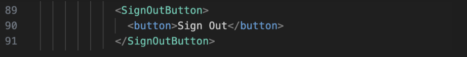
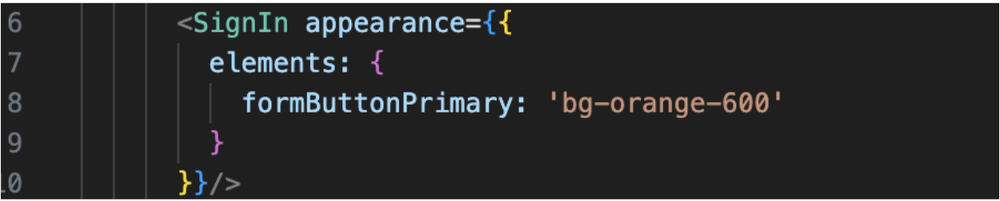
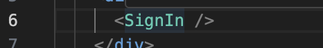

# Minimal Reproduction - <SignIn /> Component - Clerk and NextJS

I ran into a issue  when using the <SignIn /> and <SignOutButton /> components inside a NextJS project using App Router. 
  
If you add the apperance prop to the <SignIn /> and a  user click the <SignOutButton /> to sign out the <SignIn /> component will not render until you refresh the screen.
  
If you refresh the screen at any point between signing in and signing out the <SignIn /> component will appear. But, if the broswer does not refresh between signing in and signing out. The <SignIn /> component will not render.
  
## Steps to Reproduce

1. Clone NextJS Repo
2. Run ‘npm install next@14.0.0’
3. Create application on clerk. Copy publishable key and secret key
4. Rename ‘env.template’ to ‘env.local’.
5. Paste keys from Clerk into file
6. Run ‘npm run dev’
7. Create account on site
8. In ‘@/app/layout.tsx’ add the following code underneath the </SignedIn> tag on line 89.

9. Add the following appearance prop to the <SignIn /> component in ‘@/app/sign-in/[[…sign-in]]/page.tsx’

10. Control + C in Terminal to stop running the development server.
11. Run ‘npm run dev’
12. Click ‘View Demo’
13. Sign In
14. Click ‘Sign Out’ button in top-right corner of screen
15. Blank screen should appear (NOTE: If the <SignIn /> component renders repeat steps 13 and 14. The component should does not render again).

NOTE: If you refresh the page the <SignIn /> component will render.

16. Remove appearance prop from <SignIn /> component in ‘@/app/sign-in/[[…sign-in]]/page.tsx’

17. Save file and repeat steps 13 and 14. The <SignIn /> component will render.

## Further Tests

I found that if the browser refreshes at any point before clicking the ‘Sign Out’ button then the <SignIn /> component with appearance props will render.

### Steps To Re-Create:

1. Add an appearance prop back to the <SignIn /> component

2. Repeat step 13 from steps above.
3. Refresh browser
4. Click ‘Sign Out’ button in top-right corner of screen
The <SignIn /> component will render with the appropriate appearance props.

## Other Notes

I downgraded Next to version 13.5.6 and repeated the steps to reproduce above. The same outcome occurred. I also downgraded Clerk to 4.21.8, repeated the steps above and got the same outcome.
